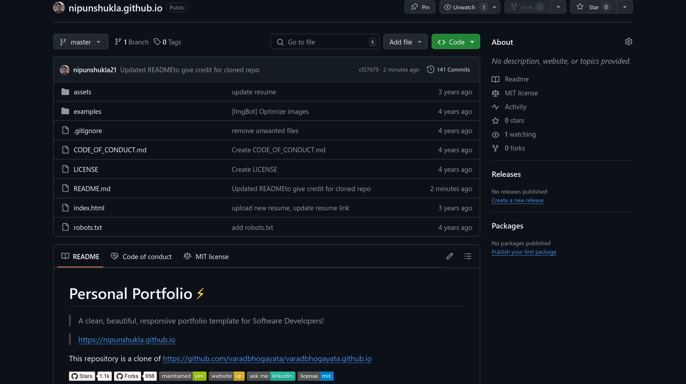
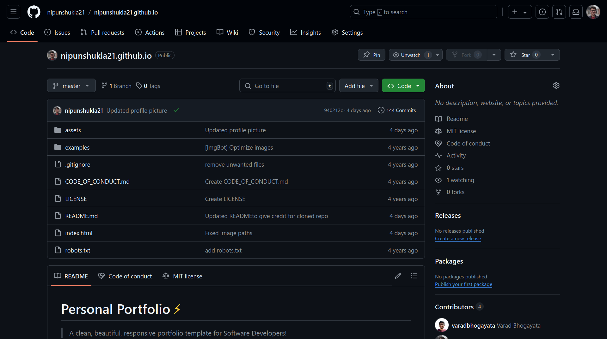
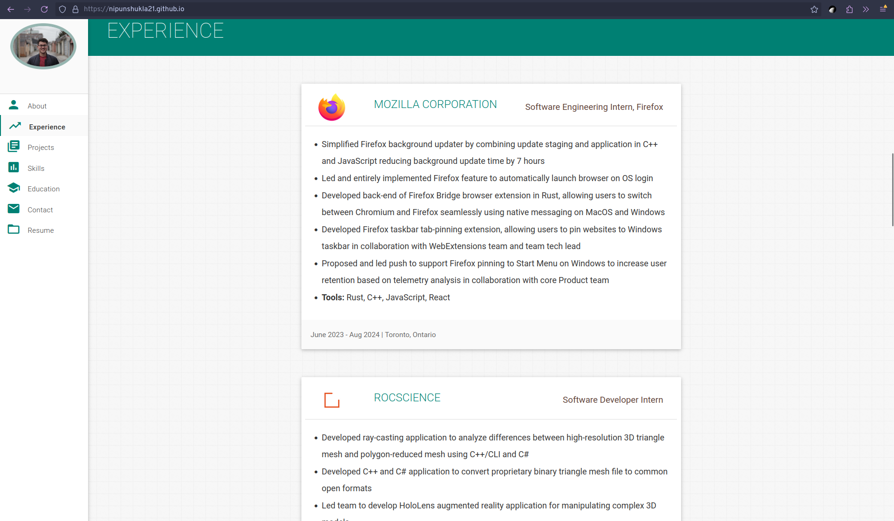
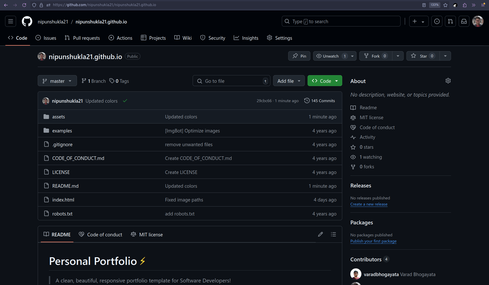
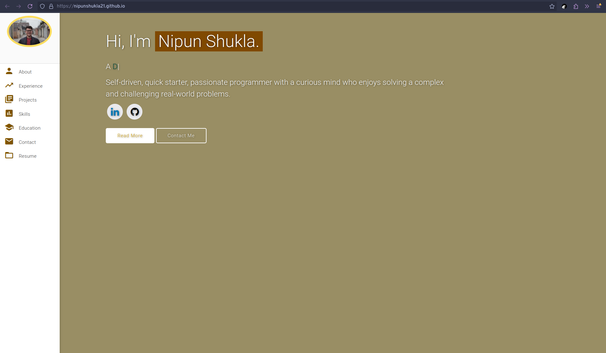
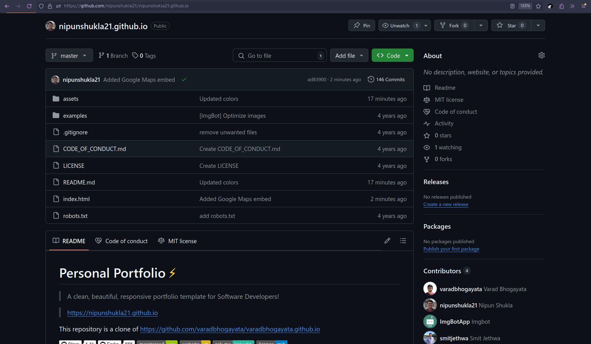
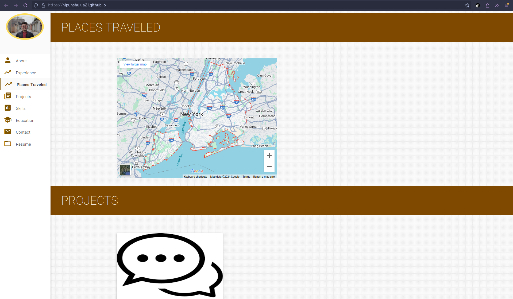
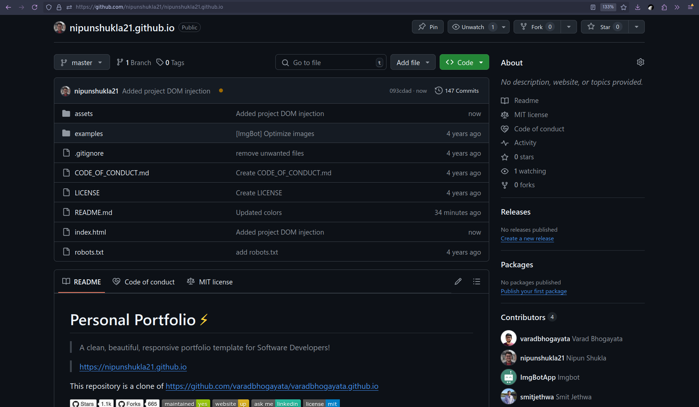
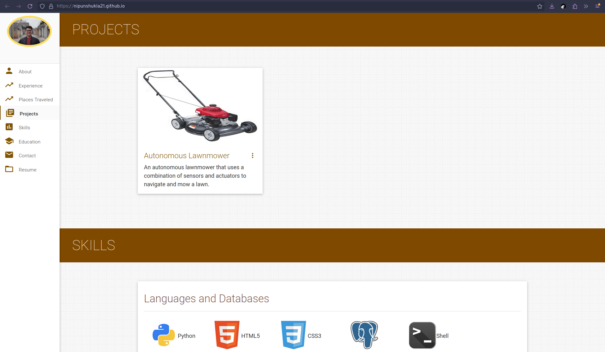

# Personal Portfolio ⚡️ 
> A clean, beautiful, responsive portfolio template for Software Developers!

> https://nipunshukla21.github.io

This repository is a clone of https://github.com/varadbhogayata/varadbhogayata.github.io

# Activities Overview

## Activity 1

## Activity 2

## Activity 3

## Activity 4

## Activity 5

## License 📄
This project is licensed under the MIT License - see the [LICENSE.md](./LICENSE) file for details.
